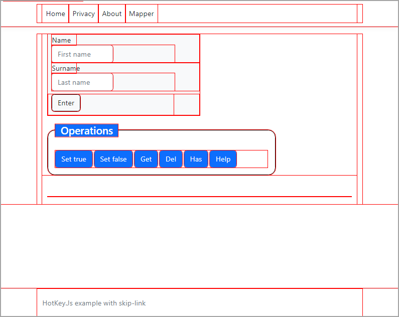
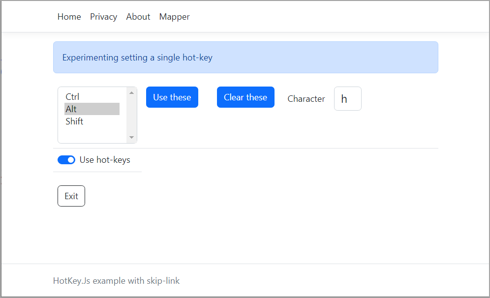
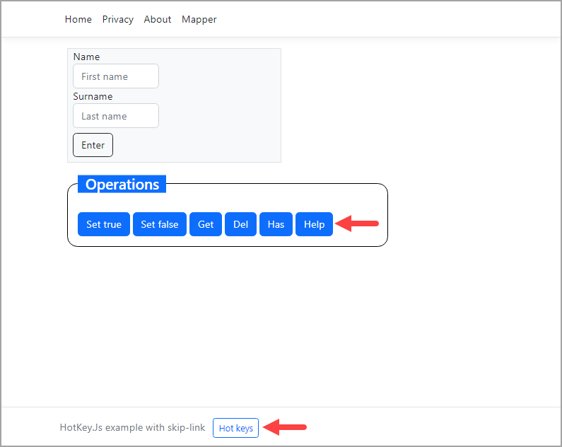
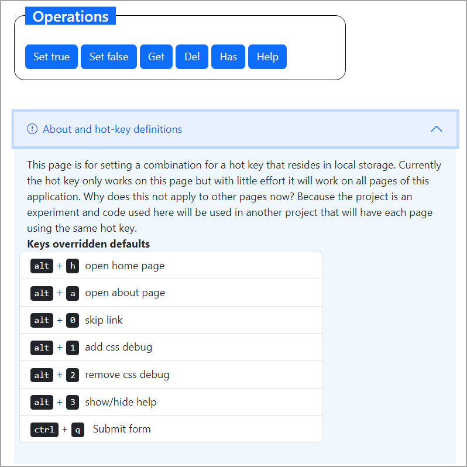

# Creating hot-keys for web applications

## Introduction

Learn how to create hot-keys for web applications, in this case the project type is Razor Pages but what will be presented works with ASP.Net Core and conventional web projects.

Setting and removing hot keys is very easy but if a developer simply drops code in without seeing a working example and a plan suddenly working with hot keys can become frustrating so take time to run through the code.

## WCAG

By properly implementing hot keys a web application can assist keyboard only users navigate your site but not providing assistance to users how only use a keyboard may lose customers.

## Requries to run

Microsoft Visual Studio 2022 athough opening up the code say in Visual Studio Code a developer can study the code, pick out what is needed and adapt to their project.


## Core functionality

A JavaScript library, [hotkeys-js](https://www.npmjs.com/package/hotkeys-js) and on [GitHub](https://github.com/jaywcjlove/hotkeys) provides the following methods

- Add a hot-key, single key or key combination
    - Allows hot keys to be set by scope, the default when not specified is `all`. Using scope gives finer control over hot keys e.g. rather than removal all, remove a single group of hot keys.
- Remove hot keys

## Accessibility/no keytraps

When an application has hot keys, provide a method to turn them off and allow the users to reconfigure the hot keys. The sample code provides examples for turning off hot keys and reconfiguring hot keys. This means providing an interface to perform these task.

## LocalStorage

For the code presented, localStorage is used to remember a user settings. There is a check to see if the current browser supports localStorage, see [browser compatibility](https://developer.mozilla.org/en-US/docs/Web/API/Window/localStorage#browser_compatibility).


## Core code

Core code is in wwwroot/js/Application.js

| Method        |   Description 
|:------------- |:-------------
| supportsLocalStorage | Does browser support localStorage |
| hasStorage | Determines if there are setting currently for the user |
| setHomeKey | Sets the hot key to return to the main page which is configurable |
| setStandardKeys| Set hot keys for the Index page which are hard coded |
| showHideAccordion | Via hot key or button click show help |
| setAboutPageKeys | Set hot keys for the About page |
| setFormSubmitHotKey | Hot key to focus a submit button with an id of `btn-submit` |
| setPrivacyPageKeys | Set hot keys for Privacy page |
| removeKeys | Remove all hot keys for the current page |
| isEnabled | Indicates if hot keys are enabled |
| saveKeys | Saves hot key for home page |
| getHomeHotKey | Get home hot key |

## Example for setting a hot key

The following sets up a hot key to present a window which allows the user to skip the navigation of an application which is known as a [skip link](https://webaim.org/techniques/skipnav/).

<kbd>alt</kbd>, <kbd>0</kbd>

```javascript
hotkeys('alt+0', function (event) {
    $("#skipper").focus();
});
```

### Skip link in source code

- See Pages/Shared/_Layout.cshtml which contains a link with an id of `skipper` which points to an anchor for a any page with a element with an id of `main-content`
- See wwwroot/css/site.css for styling the skip link at line 24.

## Example for setting a hot key

```javascript
hotkeys.unbind('alt+0');
```

## Hot key for writing code

Nobody is an expert of styling with CSS so I have included a method to inspect a page CSS.

Press <kbd>alt</kbd>, <kbd>1</kbd> to see borders surrounding elements. Press <kbd>alt</kbd>, <kbd>2</kbd> to remove the borders.



Under the covers we have debugger.css

```css
* {
    outline: 1px solid red;
}

    *:hover {
        outline: 2px solid blue;
    }

```

In wwwroot/js see debuggerHelp.js which has a method to inject the above file into the current page and a method to remove the file.

```javascript
var $DebugHelper = $DebugHelper || {};
$DebugHelper = function () {

    /*
     * Add/remove debugger.css to the current page
     * There is no check to see if the style is present or not, its
     * a developer tool so if that is not okay with you feel free
     * to add assertions in.
     */

    var href = "../css/debugger.css";
    var addCss = function() {
        var head = document.head;
        var link = document.createElement("link");

        link.type = "text/css";
        link.rel = "stylesheet";
        link.href = href;

        head.appendChild(link);
    };

    var removeCss = function() {
        $('link[href="' + href + '"]').remove();
    };

    return {
        addCss: addCss,
        removeCss: removeCss
    };
}();
```

Back in Application.js, setup hot keys

```javascript
hotkeys('alt+1', function (event) {
    event.preventDefault();
    $DebugHelper.addCss();
});


hotkeys('alt+2', function (event) {
    event.preventDefault();
    $DebugHelper.removeCss();
});
```

## How to remember hot keys

This is done using localStorage.

The following shows an interface to set the home hot key.

- A select setup for multiple selections.
- An input for a single key
- The `Use these` button saves selections to local storage
- The `Clear these` button clear the hot key from local storage
- The `Use hot keys` check box indicates to use or not use the hot key.

> **Note**
> Only one hot key is shown as showing the above for all hot keys would make it hard for some readers to understand the code.




**Backend code**

```javascript
$(document).ready(function (e) {

    if ($Application.supportsLocalStorage()) {

        document.getElementById("useHotKeys").checked = getFunction();

        // determine if there are hot keys set in local storage
        if (localStorage.getItem('appControlKeys') && localStorage.getItem('appKey')) {
            var array = localStorage.getItem('appControlKeys').split('+');
            $("#keyCombinationsSelect").val(array);
            document.getElementById('keyCombinationsCharacter').value = localStorage.getItem('appKey');
            // apply hot-key
            $Application.setHomeKey(localStorage.getItem('appControlKeys') + '+' + localStorage.getItem('appKey'));
        }

        $Application.setKeys();        
    }

});


// change item
function handleClick(cb) {
    if ($Application.supportsLocalStorage()) {
        localStorage.setItem("useHotKeys", cb.checked);
    }
    
}

// get current setting
function getFunction() {
    if ($Application.supportsLocalStorage()) {
        if (localStorage.getItem('useHotKeys') === 'true') {
            return true;
        } else {
            return false;
        }        
    }
}

/*
 * Clear home hot key
 */
function clearCombinationsSelected() {
    if ($Application.supportsLocalStorage()) {
        $("#keyCombinationsSelect option:selected").prop("selected", false);
        localStorage.setItem("appControlKeys", "");
        localStorage.setItem("appKey", "");
        document.getElementById('keyCombinationsCharacter').value = '';        
    }
}

/*
 * Save home hot key
 */
function saveCombinations() {
    if ($Application.supportsLocalStorage()) {
        var options = document.getElementById('keyCombinationsSelect').selectedOptions;
        var values = Array.from(options).map(({ value }) => value);

        if (!Array.isArray(values) || !values.length) {
            return;
        }

        var item = document.getElementById('keyCombinationsCharacter').value.trim();
        if (item) {

            var controlKeys = values.join("+");
            var key = Array.from(item)[0];
            console.log(`selections ${controlKeys}, ${key}`);
            console.log();

            const array = controlKeys.split('+');
            for (var index = 0; index < array.length; index++) {
                console.log(array[index]);
            }

            $Application.saveKeys(controlKeys, key);

        }        
    }
}


function exit() {
    window.location.replace("Index");
}
```

**Frontend code**

```html
<link rel="stylesheet" href="lib/bootstrap-icons/font/bootstrap-icons.min.css" />

<div class="alert alert-primary" role="alert">
    Experimenting setting a single hot-key
</div>

<div class="row" id="main-content">
    <div class="table-responsive-lg">
        <table class="table">
            <tr>

                <td style="width: 8em;">
                    <select id="keyCombinationsSelect" 
                            name="keyCombinationsSelect" 
                            class="form-select" 
                            style="width: 9em;" 
                            multiple aria-label="control keys for building hot key">
                        <option value="Ctrl">Ctrl</option>
                        <option value="Alt">Alt</option>
                        <option value="Shift">Shift</option>
                    </select>
                </td>

                <td style="width: 8em;">
                    <button class="btn btn-primary" onclick="saveCombinations()">Use these</button>
                </td>

                <td style="width: 8em;">
                    <button class="btn btn-primary" onclick="clearCombinationsSelected()">Clear these</button>
                </td>

                <td>
                    <div class="row g-3 align-items-center">
                        <div class="col-auto">
                            <label for="keyCombinationsCharacter" class="col-form-label">Character</label>
                        </div>
                        <div class="col-auto">
                            <input type="text"
                                   id="keyCombinationsCharacter"
                                   class="form-control text-lowercase fs-5"
                                   style="width: 2.5em"
                                   maxlength="1"
                                   aria-describedby="character for hot key">
                        </div>

                    </div>
                </td>
            </tr>

            <tr>
                <td>
                    <div class="form-check form-switch">
                        <input class="form-check-input" type="checkbox" id="useHotKeys" onclick='handleClick(this);'>
                        <label class="form-check-label" for="useHotKeys">Use hot-keys</label>
                    </div>
                </td>
            </tr>

        </table>

        
    </div>


</div>

<div class="mt-2">
    <div class="col-sm-10">

        <button type="submit"
                id="btn-submit"
                onclick="exit()"
                class="btn btn-outline-dark ms-2 mb-2"
                aria-keyshortcuts="Ctrl+Q">
            Exit
        </button>

    </div>
</div>

@await Html.PartialAsync("_KeyMapper")


@section Scripts
{
    <script language="javascript" src="js/keyMapper.js"></script>
}
```

# Giving choices

It's never a good idea to have hot keys without the user knowing about them. In the code sample, on the home page there is a button labeled Help to present hot keys to the user. And in the footer the same functionality.








## Article

https://dev.to/karenpayneoregon/creating-hot-keys-for-web-applications-cp2
